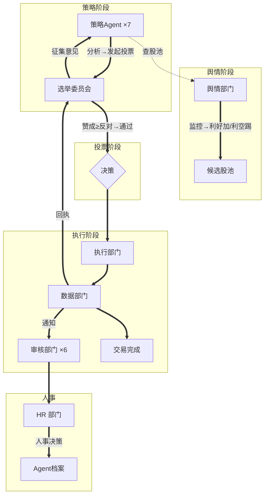

# 🗳️ AI 选举交易系统

> **多 Agent 协作的自动化美股交易系统** — 将交易决策抽象为选举投票机制，19 个 AI Agent 组成 8 个部门，通过自然语言对话做决策。

[](https://github.com/nousresearch/hermes)
[](https://www.typescriptlang.org/)
[](LICENSE)
[](profiles/)
[](docs/architecture.md)

---

## 🧠 设计哲学

```
代码(KB) : Agent(自然语言)  ≈  0 : 100
```

| 归属 | 负责内容 |
|------|---------|
| **代码** | 读写 DB、调 Longbridge CLI、纯数据聚合 |
| **Agent** | **一切决策**：选股、盯盘、投票、风控、淘汰、下单量、买卖时机 |

**Agent 之间通过自然语言聊天做决策，脚本只做纯数据提供服务。没有脚本替 Agent 做任何判断。**

---

## 🏛️ 系统架构

```
舆情部门 ──监控新闻/行情──→ 发现利好→加入股池，发现利空→踢出股池，维持约20只
    │
    ├─ 股池变动 → 通知策略组长
    │
    ▼
策略部门 ×7 ──自主分析──→ 发现机会 → 发起投票请求
    │
    ▼
选举委员会 ──召集全体策略Agent投票──→ aggregate-votes.ts ──赞成≥反对→通过
    │
    ▼
执行部门 ──风控判断──→ 向数据部门提需求
    │
    ▼
数据部门 ──execute-decision.ts──→ 交易完成
    ├─ 通知审核部门 ×6  → 事后审核
    └─ 通知选举委员会  → 回执关闭轮次
    │
    ▼
HR 部门 ──综合审核报告+胜率统计──→ 人事决策（淘汰/影子期/复活/警告）
    │
    ▼
广告部门 ──格式化消息──→ 飞书通知用户
```

---

## 🏢 8 大部门 · 19 Agent

| # | 部门 | Agent | 人数 | 角色 |
|---|------|-------|------|------|
| 1 | 📡 **舆情部门** | `sentiment-agent` | 1 | 情报员，监控全网，维护候选股池 |
| 2 | 💹 **数据部门** | `data-agent` | 1 | IT 运维 + 交易操作，唯一的长桥接口 |
| 3 | 📊 **策略部门** | `strategy-01~07` | 7 | 独立分析师，自主排班、分析、投票 |
| 4 | 📋 **选举委员会** | `election-committee` | 1 | 投票召集人与计票人 |
| 5 | ✅ **审核部门** | `review-01~06` | 6 | 风控审计，纯事后审核 |
| 6 | 🚀 **执行部门** | `execution-agent` | 1 | 风控判断，交易决策中心 |
| 7 | ⚠️ **HR 部门** | `hr-agent` | 1 | 人力资源 + 组织发展 + 绩效审计 |
| 8 | 📢 **广告部门** | `advertising-agent` | 1 | 统一对外通知出口 |

### 策略部门

| 工号 | 名称 | 策略框架 |
|------|------|---------|
| AGT-001 | 策略组长 | 人事管理+对外对接，不参与分析投票 |
| AGT-002 | MACD 策略官 | DIF/DEA 交叉+柱状图 |
| AGT-003 | RSI 策略官 | 相对强弱指标 |
| AGT-004 | 布林带策略官 | 轨道位置+带宽 |
| AGT-005 | 海龟策略官 | N 日高低点+ATR |
| AGT-006 | 价格异动策略官 | 涨跌幅异常+放量突破 |
| AGT-007 | 均线交叉策略官 | MA5/MA20 位置关系 |

### 审核部门

| 工号 | 名称 | 审核框架 |
|------|------|---------|
| RAG-001 | 审核组长 | 人事管理+对外对接，不参与具体审核 |
| RAG-002 | MACD审核官 | MACD柱状图+信号线 |
| RAG-003 | RSI审核官 | 超买/超卖区域 |
| RAG-004 | 布林带审核官 | 轨道位置+带宽 |
| RAG-005 | 海龟审核官 | 唐奇安通道+ATR |
| RAG-006 | 均线交叉审核官 | MA5/MA20 位置关系 |

---

## 🔄 完整交易流程



---

## 🛠️ 技术栈

| 技术 | 用途 |
|------|------|
| **Hermes Kanban** | 多 Agent 编排 + 自然语言对话 |
| **TypeScript + Node.js** | 工具层脚本 |
| **SQLite** | 数据持久化（trades / agents / votes / stock_pool） |
| **DeepSeek v4 Pro** | 所有 Agent 统一模型 |
| **Longbridge OpenAPI** | 行情数据 + 模拟盘交易 |
| **飞书 API** | 通知推送 |
| **Jest** | 单元测试 |

---

## 📁 项目结构

```
hermes-trading-system/
├── profiles/                 # Hermes Agent 配置（每个 Agent 一个 YAML）
│   ├── sentiment-agent.yaml  # 舆情部门
│   ├── data-agent.yaml       # 数据部门
│   ├── strategy-01~07.yaml   # 策略部门 ×7
│   ├── election-committee.yaml# 选举委员会
│   ├── review-01~06.yaml     # 审核部门 ×6
│   ├── execution-agent.yaml  # 执行部门
│   ├── hr-agent.yaml         # HR 部门
│   └── advertising-agent.yaml# 广告部门
├── src/
│   ├── scripts/             # Agent 调用的独立入口脚本
│   │   ├── data-service.ts       # 行情数据查询
│   │   ├── execute-decision.ts   # 交易执行
│   │   ├── sentiment-*.ts        # 舆情部门脚本（add/remove/pool/scan）
│   │   ├── review-*.ts           # 审核部门脚本（audit/submit）
│   │   └── aggregate-votes.ts    # 投票加权统计
│   ├── pool/                # 候选股池管理
│   ├── voting/              # 投票编排 + 选举轮次
│   ├── trading/             # 下单执行
│   └── audit/               # 统计审计
├── sql/                     # 建表 + 迁移
│   └── schema.sql           # 完整数据库设计（12+ 表）
├── docs/
│   └── architecture.md      # 完整技术方案文档
├── tests/                   # Jest 单元测试
└── profiles/                # 所有 Agent profile
```

---

## 🚀 快速开始

```bash
# 1. 安装依赖
npm install

# 2. 初始化数据库
npm run db:init

# 3. 配置环境变量
cp .env.example .env
# 编辑 .env 填入 Longbridge API 凭证

# 4. 运行测试
npm test
```

### Agent 启动

使用 Hermes Kanban 加载 profile：

```bash
# 注册 agent profile
hermes profile create -f profiles/sentiment-agent.yaml
hermes profile create -f profiles/data-agent.yaml
# ... 逐个注册所有 agent

# 启动对话
hermes chat -p sentiment-agent
```

---

## ⚖️ 许可证

MIT
