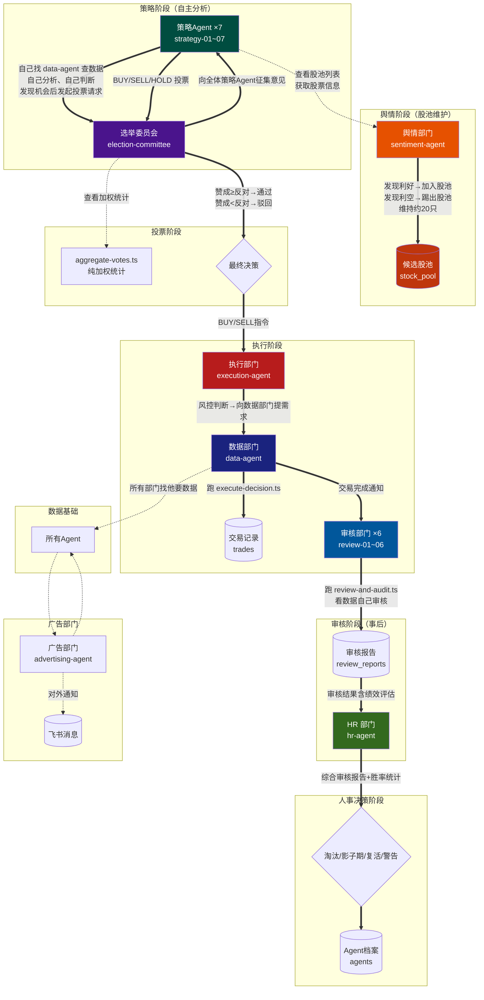
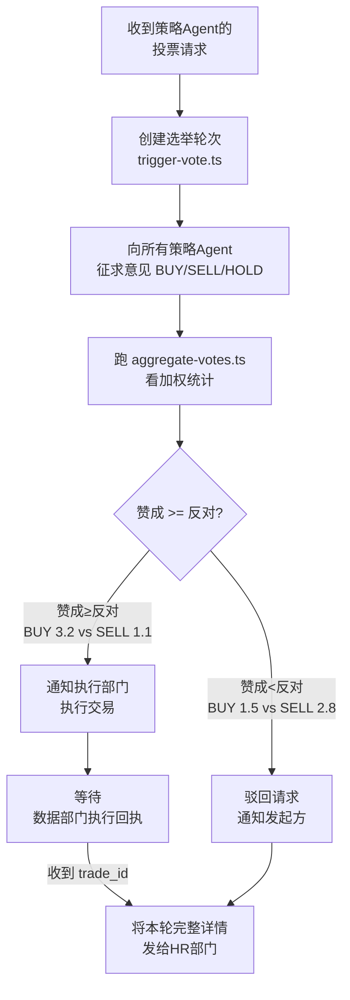
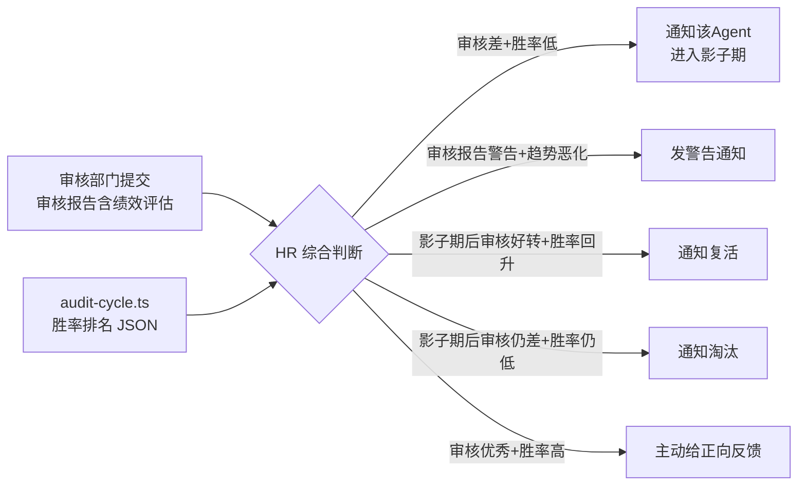
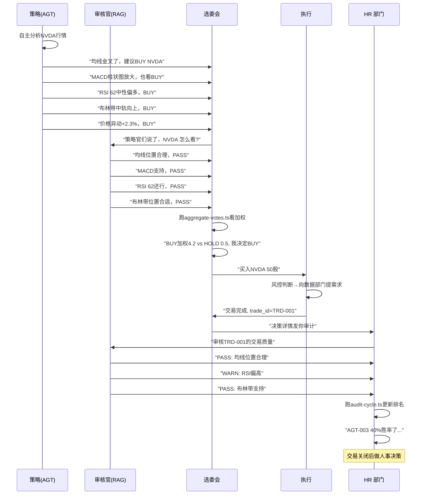

# AI 选举交易系统 — 技术方案 v4.4

> **版本**: v4.4 (2026.05.24) | **状态**: 编码完成+守护进程就绪 | **Agent 数量**: 19+ | **部门**: 9 (新增回测部门) | **改造**: 2026.05 — 所有决策完全交给 Agent 自然语言，脚本仅做纯数据读写 | **合并**: 2026.05 — 选股+盯盘合并为策略部门，7 位分析师自主分析 | **v4.4 新增**: 知识库体系落地——各部门经验库已初始化、回测部门文档完备、跨部门知识索引已建立 | **v4.3 新增**: CEO巡检诊断系统、知识库体系、回测部门BKT-001、经验积累机制、问题升级链、公司规章制度、部门文档体系、广告部去重、策略Agent数据频次管理、投票并发控制 | **v4.2 移除**: 海龟策略TS引擎 | **v4.1 新增**: 广告通知子系统、股池查询服务、渠道适配器 | **变更**: scheduler.ts 已删除，策略部门合并到 strategy-director 接管调度

---

## 1. 设计哲学

```
代码(KB):Agent(自然语言)  ≈  0:100
```

| 归属 | 负责内容 | 示例 |
|------|---------|------|
| **代码** | 读写 DB、调 Longbridge CLI、纯数据聚合 | `data-service.ts` 查询行情、`aggregate-votes.ts` 统计加权票数 |
| **Agent** | **一切决策**：选股、盯盘、投票、风控、淘汰、下单量、买卖时机 | "NVDA 均线金叉了，我觉得可以买"、"RAG-003 40%胜率进影子期" |

核心原则：**Agent 之间通过自然语言聊天做决策，脚本只做纯数据提供服务。没有脚本替 Agent 做任何判断。**

已删除的所有替 Agent 决策的脚本：
- ~~`smart-scanner.ts`~~ — 之前替 Agent 做选股和止损判断
- ~~`selector-technical.ts`~~ — 之前替 Agent 做技术指标判断
- ~~`selector-risk.ts`~~ — 之前替 Agent 做止损/止盈判断

---

## 2. 系统架构总览



### 数据流简图

```
|舆情部门 ──监控新闻/行情/爬虫──→ 自己分析 → 发现利好→加入股池，发现利空→踢出股池
|策略Agent ──找舆情部门看股池──→ 获取候选股列表 ──找 data-agent 要数据──→ 行情 JSON ──自己分析→ 发起投票请求给选举委员会
|选举委员会 ──向全体策略Agent征集意见──→ 汇总投票 ──跑 aggregate-votes──→ 加权统计 ──赞成≥反对→通过→通知执行部门
|执行部门 ──做风控判断──→ 向数据部门提需求──→ 数据部门跑 execute-decision──→ 交易完成通知审核部门
|数据部门 ──交易完成通知──→ 选举委员会 ──收到回执后→ 发审计详情给HR部门
|数据部门 ──交易完成通知──→ 审核官 ──跑 review-and-audit──→ 交易详情 ──自己审核→ PASS/WARN/FAIL+绩效评估
|审核部门 ──审核报告提交──→ HR 部门 ──综合审核结果+胜率统计→ 淘汰/影子期/复活/警告
|其他部门 ──自然语言咨询──→ HR 部门 ──查阅知识库→ 告知对接部门
|任何部门 ──发现流程问题→ 组长 ──解决不了→ HR ──拿不定主意→ 广告部门─→飞书发起投票给用户
|任何部门 ──自然语言告知──→ 广告部门 ──格式化后→ 飞书消息给用户
|任何Agent ──"XX需求该找谁?"──→ HR部门 ──查阅组织架构知识库→ 告知对接部门
```

---

## 3. 6 大部门职责

### 3.1 部门矩阵

| # | 部门 | Agent | 工号体系 | 人数 | 对话风格 | 自然人对应 |
|---|------|-------|---------|------|---------|-----------|
| 1 | **舆情部门** | `sentiment-agent` | — | 1 | 情报员，监控全网 | 数据分析/情报分析 |
| 2 | **数据部门** | `data-agent` | — | 1 | 工具人，你问我答 | IT 运维 + 交易操作 |
| 3 | **策略部门** | `strategy-01~07` | AGT-001~007 | 7 | 独立分析师，自主排班 | 分析师/交易员 |
| 4 | **选举委员会** | `election-committee` | — | 1 | 最终拍板人 | 投资总监 |
| 5 | **审核部门** | `review-01~06` | RAG-001~006 | 6 | 事后诸葛亮 | 风控审计 |
| 6 | **执行部门** | `execution-agent` | — | 1 | 风控判断，向数据部门提需求 | 风控官 |
| 7 | **HR 部门** | `hr-agent` | — | 1 | 组织人事 | 人力资源/组织发展 |
| 8 | **广告部门** | `advertising-agent` | — | 1 | 传声筒，有求必应 | 公关/客服 |
| 9 | **回测部门** | `backtest-agent` | BKT-001 | 1 | 每日回测验证策略质量 | 质量保证 |

### 3.2 各部门详细职责

#### 舆情部门 — sentiment-agent

```
角色定位：系统唯一的候选股池维护者
工作方式：自主监控新闻/行情/爬虫，将利好股票加入股池，利空股票踢出股池，维持约 20 只候选股
```

舆情部门全权负责股池管理。策略部门**只读取、不写入**股池。

核心工作流程：
1. **监控与发现** — 查看新闻、热门股票、财报、价格异动，自己判断哪些利好
2. **加入股池** — 发现利好股票，跑 `sentiment-add.ts` 写入 stock_pool 表
3. **通知策略组长** — 股池变动后，立即通知 strategy-director："刚把 NVDA 加入股池，利好，强度 4"
4. **清理与维护** — 发现利空信号，跑 `sentiment-remove.ts` 标记为 REMOVED，同时通知 strategy-director
5. **过期清理** — 超时（7天）未分析的信号自动过期
6. **供策略部门查询** — 策略分析师自然语言问"当前股池有什么"，舆情部门跑 `sentiment-pool.ts --list` 回复

策略组长收到通知后，向组员分配分析任务。每个分析师自主决定用什么周期、什么形式监控。

| 请求类型 | 实际命令 |
|---------|---------|
| 市场扫描 | `sentiment-scan.ts --all` |
| 加入利好信号 | `sentiment-add.ts --symbol NVDA.US --signal-type BULLISH --strength 4 --source "财报分析" --reason "Q1营收超预期"` |
| 踢出利空信号 | `sentiment-remove.ts --symbol NVDA.US --reason "出口限制加严"` |
| 查看当前股池 | `sentiment-pool.ts --list` |

重要规则：
- **舆情部门是股池的唯一维护者**，策略部门只读不写
- 舆情部门只做数据获取和写入，**不做交易决策**
- 维持股池约 20 只活跃候选股

#### 数据部门 — data-agent

```
角色定位：系统唯一的长桥 API 接口
工作方式：被动响应，其他部门通过自然语言请求数据或执行交易
```

数据部门负责**所有长桥 API 调用**，包括行情查询和交易执行：

| 请求类型 | 实际命令 |
|---------|---------|
| "查 NVDA 报价" | `data-service.ts --type quote --symbol NVDA.US` |
| "查 AAPL 最近 30 天 K 线" | `data-service.ts --type kline --symbol AAPL.US --days 30` |
| "查 NVDA 新闻" | `data-service.ts --type news --symbol NVDA.US` |
| "查账户情况" | `data-service.ts --type account` |
| "看自选股行情" | `data-service.ts --type watchlist` |
| "看当前持仓" | `data-service.ts --type positions` |
| "执行部门说：买入 NVDA 50 股" | `execute-decision.ts --action BUY --symbol NVDA.US --quantity 50` |
| "执行部门说：卖出 NVDA" | `execute-decision.ts --action SELL --symbol NVDA.US --quantity 0` |

重要规则：
- **其他部门不能直接操作长桥 API**，必须通过 data-agent
- 交易执行由执行部门提需求 → 数据部门执行 → 结果返回给执行部门
- 数据部门不做风控判断，收到指令就执行

#### 策略部门 — strategy-01~07

```
角色定位：独立分析师团队，自主排班、自主分析、自主投票
工作方式：每个分析师自己决定分析节奏和标的，组长只负责人事管理和对外对接
```

| 工号 | 名称 | 策略框架 | 分析视角 |
|------|------|---------|---------|
| AGT-001 | 策略部门组长 | — | 负责人事管理和对外对接，**不参与分析投票** |
| AGT-002 | MACD 策略官 | DIF/DEA 交叉+柱状图 | "MACD 支持哪个方向？有没有背离？" |
| AGT-003 | RSI 策略官 | 相对强弱指标 | "现在是超买还是超卖？趋势配合吗？" |
| AGT-004 | 布林带策略官 | 轨道位置+带宽 | "价格在布林带哪个位置？带宽有收缩吗？" |
| AGT-005 | 海龟策略官 | 突破 N 日高低点+ATR | "有突破吗？突破质量如何？" |
| AGT-006 | 价格异动策略官 | 涨跌幅异常+放量突破 | "盘面有什么异动？量价配合如何？" |
| AGT-007 | 均线交叉策略官 | MA5/MA20 位置关系 | "均线在说什么？金叉还是缠绕？" |

策略部门的核心工作方式：

1. **查看股池** — 从舆情部门（sentiment-agent）获取当前候选股列表，知道哪些股票值得关注
2. **自主选标的** — 自选股、热点标的、盘中异动，各自挑
3. **自我分析** — 找 data-agent 查行情数据，用自己的策略框架判断
4. **发起投票请求** — 发现交易机会后，发起投票请求给选举委员会。选举委员会向全体策略 Agent 征求意见，赞成>=反对则通过

组长 AGT-001 只负责对外接口和人事管理，**不参与具体策略分析和投票**。舆情部门股池变动时通知组长，组长分配分析任务给组员。组员自主决定监控周期和方式，完成后回复组长进度。

没有脚本替他们做选股判断。所有决策依靠 Agent 自己的分析能力。】

#### 选举委员会 — election-committee

```
角色定位：投票召集人与计票人
工作方式：收集策略部门投票，赞成>=反对则提交执行部门
```

选举委员会**自己不做行情分析**。分析是策略部门的事。
选举委员会**不做风控判断**。风控是执行部门的事。
选举委员会的唯一职责是：召集投票 → 统计 → 判断通过/驳回 → 通知 → 等回执 → 审计。

冷却规则：同一标的在一小时内不能重复发起投票轮次，脚本 `createElectionRound` 中会检查，命中冷却时抛出错误。

工作流程：



关键差异对比（重构前后）：

| 阶段 | 之前（代码决策） | 之后（Agent 决策） |
|------|---------------|-----------------|
| 投票聚合 | `determineDecision()` 5步算法自动出结果 | Agent 读 JSON 自己判断 |
| 投票征集 | 代码自动调审核官投票 | 选举委员会向全体策略 Agent 自然语言征集 |
| 投票规则 | 算法自动得权重 | 赞成 >= 反对 则通过 |
| 下单量 | 代码自动计算 | Agent 自己算 |
| 最终决策 | 代码输出 BUY/SELL/HOLD | Agent 自己拍板 |

#### 审核部门 ×6 — review-01~06

**纯事后审核。** 不参与任何事前流程——不投票、不预测、不分析候选标的。
交易执行完成后，数据部门将交易详情发送给审核部门，审核官基于各自框架评估决策质量。
审核官没有硬性规则——他们看 K 线数据后自己分析、自己判断。

审核结果包含两方面：
1. **技术审核** — PASS / WARN / FAIL + 分析理由，证明该交易在技术面上是否合理
2. **Agent 绩效评估** — 该笔交易中各参与 Agent 的表现评价（谁的判断准确、谁的判断有偏差）

| 工号 | 名称 | 审核框架 | 审核视角 |
|------|------|---------|---------|
| RAG-001 | 审核部门组长 | — | 只负责人事管理和对外对接，**不参与具体审核** |
| RAG-002 | MACD审核官 | MACD柱状图+信号线 | "DIF/DEA 是否支持该方向?" |
| RAG-003 | RSI审核官 | 超买/超卖区域 | "入场时 RSI 在合理区间吗?" |
| RAG-004 | 布林带审核官 | 轨道位置+带宽 | "价格在布林带中的位置合适吗?" |
| RAG-005 | 海龟交易审核官 | 唐奇安通道 | "是否形成了有效突破?" |
| RAG-006 | 均线交叉审核官 | MA5/MA20 位置关系 | "买入时均线位置合理吗？" |

输出：**审核报告**（含技术审核结论 + Agent 绩效评估），写入 `review_reports` 表，同时提交给 HR 部门并提醒 HR 执行审计。

HR 部门收到审核报告后执行审计流程（被动触发），同时也主动定期扫描胜率数据。

HR 部门综合审核报告 + 胜率统计数据，决定 Agent 的人事状态（淘汰/影子期/复活/警告）。

升级决策链路（仅协作流程问题）：Agent → 组长 → HR → （拿不定主意）→ 广告部门 → 飞书发起投票给用户。股票买卖决策不在此列，由选举委员会决定。

审核部门**不直接做人事决策**。他们只管审核交易质量，人事决定权在 HR。

#### 执行部门 — execution-agent

```
角色定位：风控判断和交易决策中心
工作方式：向数据部门提需求，不直接操作长桥 API
```

职责：
1. 收到选举委员会的 BUY/SELL 指令后做风控判断
2. 风控通过后，**向数据部门提需求**执行下单
3. 持续监控持仓，发现卖出信号报告选举委员会

风控底线（Agent 自行决定是否严格遵守）：
- 单票仓位上限：20%
- 日交易次数上限：10 次
- 最低现金保留：10%
- 单笔最大亏损：5%
- 日最大回撤熔断：8%

执行部门不直接操作长桥 API。所有行情查询和交易执行通过数据部门完成：

| 执行部门的需求 | 数据部门执行 |
|--------------|-------------|
| "帮我查当前 NVDA 持仓" | `data-service.ts --type positions` |
| "帮我查账户可用资金" | `data-service.ts --type account` |
| "帮我买入 NVDA 50 股" | `execute-decision.ts --action BUY --symbol NVDA.US --quantity 50` |
| "帮我卖出 NVDA" | `execute-decision.ts --action SELL --symbol NVDA.US --quantity 0` |

#### HR 部门 — hr-agent

```
角色定位：系统的人力资源与组织发展中心
工作方式：主动记录、被动咨询、定期审计
```

HR 部门维护一个"组织架构知识库"，记录每个部门、每个 Agent 的信息：

| 信息项 | 内容 | 维护方式 |
|--------|------|---------|
| 工号 | 每位 Agent 的唯一标识 | 创建 Agent 时录入 |
| 部门 | 所属部门及组长 | 部门成立时确定 |
| 部门职责 | 该部门的核心定位 | 部门成立时确定 |
| 岗位 | 部门内的具体角色 | 创建 Agent 时录入 |
| 岗位能力 | 该 Agent 擅长做什么 | 创建 Agent 时录入，可更新 |

每个部门设一名组长：

| 部门 | 组长 | Agent |
|------|------|-------|
| 舆情部门 | sentiment-agent | sentiment-agent |
| 数据部门 | data-agent | data-agent |
| 策略部门 | strategy-01 | strategy-01~07 |
| 选举委员会 | election-committee | election-committee |
| 审核部门 | review-01 | review-01~06 |
| 执行部门 | execution-agent | execution-agent |
| HR 部门 | hr-agent | hr-agent |
| 广告部门 | advertising-agent | advertising-agent |
| 回测部门 | backtest-agent | backtest-agent |

|组长职责：组长是部门**唯一对外接口**。外部需求先找组长，组长向组员分配任务，组员完成后回复组长，组长汇总后回复给外部对接 Agent。单人部门组长即自己，直接处理所有需求。|

HR 部门的三项核心事务：

**① 人力需求对接 + 扩招 SOP**

扩招触发有两种方式：

**方式 A：组长主动提出**
部门组长如果觉得人手不足，直接找 HR 对话提用人需求。

**方式 B：组员主动向组长反馈**
组员如果任务繁重处理不过来，先向自己的组长反馈。组长确认后，组长找 HR 提用人需求。
单人部门（data-agent、execution-agent、election-committee、advertising-agent）直接找 HR。

HR 确认后执行入职。

**入职流程：**
组长向 HR 提需求 → HR 确认 → 运行 `onboard-agent.ts` 分配工号 + 生成 Profile → **组长分配具体职责和任务**

**HR 分配工号并生成 Profile**
HR 与新 Agent 对话确认信息后，运行：
```
npx tsx src/scripts/onboard-agent.ts --assign-id '{"agent_name":"...","profile_name":"...","dept_name":"...","role_title":"...","responsibilities":"...","assigned_by":"HR-001"}'
```
脚本自动完成三件事：
- 生成工号（AGT-005），写入 `agents` 表
- 记录人事变动流水到 `agent_status_log`
- **自动生成 Profile YAML 文件**到 `profiles/` 目录（含岗位、职责、组长信息）

HR 将新工号和 Profile 文件介绍给组长，**由组长负责分配具体职责和日常任务**。组长直接编辑该 YAML 文件完善 system_prompt，填入新人具体做什么事、受谁调配。

**职责写在 Profile 里，不是 DB 里**
Agent 的岗位和职责不存储在 DB 中——它们通过 `system_prompt` 写入 Profile YAML 文件。每个 Agent 启动时从自己的 Profile 读取身份信息。

HR 可使用 `--list` 随时查看组织架构全貌：
```
npx tsx src/scripts/onboard-agent.ts --list
```

**② 组织架构咨询（被动响应）**
其他 Agent 如果不知道某个需求该找谁，可以问 HR 部门。
HR 查阅知识库后，**优先返回该部门的组长**（如果是多人部门）：
"帮我查 NVDA 报价" → "这是数据部门的事，找组长 data-agent"
"对交易结果不满意需要申诉" → "找 election-committee"
"有人事问题" → "我来查一下胜率排名，直接帮你处理"

**③ Agent 绩效审计（定期执行）**

HR 的绩效审计综合两方面数据：

**数据来源 1：审核部门提交的审核报告**
审核官在每笔交易完成后提交审核报告，包含技术审核结论 + 对各个参与 Agent 的绩效评估。

**数据来源 2：胜率统计**
```
npx tsx src/scripts/audit-cycle.ts
```
输出各 Agent 的胜率、交易次数、排名等 JSON。

HR 阅读**审核报告 + 胜率数据**，综合判断做人事决策：



**④ 人事变动管理**

离职/剔除流程（三种触发场景）：

| 场景 | 谁发起 | 流程 |
|------|--------|------|
| 绩效淘汰 | HR（审计后） | HR 通知组长确认 → 执行离职 → 广告广播 |
| 组长剔除 | 组长 | 组长找 HR 提剔除需求 → HR 确认 → 执行 |
| 自行离职 | Agent 本人 | Agent 找 HR → HR 通知组长确认 → 执行 |

HR 执行离职操作：
```
npx tsx src/scripts/terminate-agent.ts --fire '{"agent_id":"AGT-003","reason":"绩效不达标","triggered_by":"HR-001","notify_leader":"AGT-001","notify_hr":"HR-001"}'
```
脚本自动：更新 agents 状态为 TERMINATED、记录变动流水、删除 profile YAML 文件。

查看已离职 Agent：
```
npx tsx src/scripts/terminate-agent.ts --list-fired
```

所有人事变动**不是代码自动执行**的。HR 判断后通过广告部门发飞书公告。

#### 广告部门 — advertising-agent

```
角色定位：系统唯一的对外通知出口
工作方式：被动响应，其他部门通过自然语言请求发送通知
```

| 请求类型 | 实际命令 |
|---------|---------|
| "策略部门说：告诉群里：AGT-002 MACD策略官 对NVDA看BUY，发起投票" | `send_message → feishu` |
| "数据部门说：告诉群里：DAT-001 数据官 NVDA买入50股已完成" | `send_message → feishu` |
| "广播一下：RAG-003 进入影子期" | `send_message → feishu` |
| "发紧急通知：日回撤 8.5% 熔断" | `send_message → feishu` |

重要规则：
1. **只有广告部门才能对外发通知**——其他部门不能直接调用飞书 API
2. 消息内容由发送方提供，广告部门只做原文传递
3. 发送后回复对方"已发送"
4. 如果对方需要先查数据（如交易广播），可以先用 broadcast-trade.ts 查，确认后再发

---

## 4. 数据库设计

SQLite，文件 `data/trading.db`。

### 4.1 表结构关系

```mermaid
erDiagram
    agents ||--o{ agent_votes : "投票"
    agents ||--o{ win_reports : "胜负上报"
    agents ||--o{ agent_traits : "人格持久化"
    agents ||--o{ review_reports : "审核报告"
    agents ||--o{ agent_status_log : "人事变动"
    agents ||--o{ strategy_signatures : "策略签名"
    trades ||--o{ agent_votes : "所属轮次"
    trades ||--o{ win_reports : "胜负"
    trades ||--o{ review_reports : "审核"
    trades ||--|| election_rounds : "对应的选举轮次"
    stock_pool ||--o{ "选股信号" : "候选池"
    daily_ledger ||--|| "每日风控" : "账簿"

    agents {
        string agent_id PK "工号 AGT-001"
        string agent_name "名称"
        string profile_name "Hermes profile 名"
        string strategy_source "策略来源"
        string strategy_summary "核心概念"
        string status "ACTIVE/SHADOW/TERMINATED"
        int win_count "胜场数"
        int total_trades "总交易数"
        float win_rate "胜率"
        float win_rate_recent_5 "近5笔胜率"
    }

    trades {
        string trade_id PK "TRD-20260521-001"
        string symbol "NVDA.US"
        string direction "LONG/SHORT"
        float buy_price "买入价"
        float sell_price "卖出价"
        int quantity "数量"
        float pnl "盈亏金额"
        float pnl_pct "盈亏比例"
        string status "OPEN/CLOSED/CANCELLED"
    }

    election_rounds {
        string round_id PK "ELEC-20260521-1430"
        string symbol "标的"
        int total_voters "总投票人数"
        int buy_votes "买票数"
        int sell_votes "卖票数"
        int hold_votes "持票数"
        string final_decision "BUY/SELL/HOLD"
        string resulted_trade_id "结果交易ID"
    }

    agent_votes {
        string vote_id PK
        string trade_id FK
        string agent_id FK
        string vote_direction "BUY/SELL/HOLD"
        float confidence "置信度 0-1"
        string reasoning "理由"
        int is_shadow "是否影子期投票"
    }

    review_reports {
        string report_id PK "REV-..."
        string trade_id FK
        string agent_id FK
        string verdict "PASS/WARN/FAIL"
        string reasoning "理由"
        string review_framework "审核框架"
    }

    agent_traits {
        string agent_id FK
        string trait_key "人格特征键"
        string trait_value "特征值"
        string trait_type "NUMBER/CATEGORY/PATTERN/HISTORY"
        float confidence "置信度"
        int sample_count "采样次数"
    }

    stock_pool {
        string symbol "标的"
        string signal_type "BULLISH/BEARISH"
        int strength "强度 1-5"
        string source "来源"
        string agent_id FK "提交信号的选股Agent"
        string status "ACTIVE/EXPIRED/REMOVED"
    }

    win_reports {
        string report_id PK
        string trade_id FK
        string agent_id FK
        string result "WIN/LOSE/MISS"
        string self_reflection "自我反思 JSON"
    }

    agent_status_log {
        int id PK
        string agent_id FK
        string from_status "原状态"
        string to_status "新状态"
        string reason "原因"
        string triggered_by "触发者"
    }

    daily_ledger {
        string date PK "2026-05-21"
        int trade_count "日交易数"
        float total_pnl "日总盈亏"
        float max_drawdown "最大回撤"
        int melted "是否熔断"
    }
```



### 4.2 核心表清单（12 张）

| # | 表名 | 用途 | 关键字段 |
|---|------|------|---------|
| 1 | `agents` | Agent 员工档案 | agent_id, status, win_rate |
| 2 | `agent_status_log` | 人事变动流水 | from_status, to_status, reason |
| 3 | `trades` | 交易主表 | symbol, direction, pnl |
| 4 | `agent_votes` | 每次投票记录 | vote_direction, confidence |
| 5 | `win_reports` | 胜负上报 | result, self_reflection |
| 6 | `election_rounds` | 选举轮次 | final_decision, total_voters |
| 7 | `stock_pool` | 候选股池 | signal_type, strength |
| 8 | `agent_traits` | Agent 人格数据 | trait_key, trait_value, confidence |
| 9 | `strategy_signatures` | 策略签名去重 | source_book, core_concept |
| 10 | `review_reports` | 审核报告 | verdict, review_framework |
| 11 | `daily_ledger` | 每日风控账簿 | trade_count, max_drawdown |
| 12 | `(schema_migrations)` | 迁移记录 | — |
| 13 | `departments` | 部门组织架构 | dept_id, dept_name, leader_agent_id |

---

## 5. 核心业务流程

### 5.1 完整交易周期

```
策略分析 → 投票 → 决策 → 执行 → 审计 → 审核
                                      ↓
                                   关闭交易
```



### 5.2 选举加权公式

纯数学公式，在 `aggregate-votes.ts` 中：

```
agent_weight = win_rate × log₂(1 + total_trades)
```

- `win_rate`: 历史胜率（0~1）
- `log₂(1 + total_trades)`: 经验因子，交易越多权重越高
- 初次交易（total_trades=0）: 权重 = 0.5

输出 JSON 示例：
```json
{
  "type": "vote_stats",
  "round_id": "ELEC-20260522-001",
  "symbol": "NVDA.US",
  "total_active_voters": 5,
  "results": {
    "buy":  { "count": 4, "weighted": 3.6 },
    "sell": { "count": 0, "weighted": 0 },
    "hold": { "count": 1, "weighted": 0.5 }
  }
}
```

### 5.3 Agent 生命周期管理

```
                ┌──────────────────┐
                │    ACTIVE        │
                │  (正常交易)       │
                └────────┬─────────┘
                         │ HR 部门判断
                         │ (≥10笔且胜率<50%)
                         ▼
                ┌──────────────────┐
                │    SHADOW        │
                │  (影子期学习)     │
                └────────┬─────────┘
                         │ 完成10笔后评估
                         │
               ┌─────────┴──────────┐
               ▼                     ▼
     ┌──────────────────┐   ┌──────────────────┐
     │    ACTIVE        │   │   TERMINATED     │
     │  (复活,胜率≥50%) │   │  (淘汰,胜率<50%)  │
     └──────────────────┘   └──────────────────┘
```

**关键变化：** 生命周期的判定**不是代码自动执行**的。HR 部门通过 `audit-cycle.ts` 查看排名 JSON 后，**自己判断并通知**相关 Agent。

---

## 6. v4.x 新增核心模块

### 6.1 中心调度器（已移除）— ~~`scheduler.ts`~~

> **v4.3 移除**: `scheduler.ts` 已删除（commit f53aea0）。原调度职责已合并到 strategy-director 中（策略组长兼调度器），见 `profiles/strategy-director.yaml`。

原设计：中心调度器作为常驻 Node.js 守护进程，定时扫描全股池、触发策略分析、推送广告通知。该流程现在由 strategy-director Agent 通过 Kanban 任务驱动，不再依赖独立 TypeScript 进程。

### 6.2 海龟策略引擎（已移除）— ~~`turtle.ts`~~

> **v4.2 移除**: 海龟策略 TypeScript 引擎（`src/strategies/turtle.ts`，571行）和 CLI 入口（`src/scripts/turtle-analyze.ts`，162行）已于 v4.2 删除。原代码实现了完整 System 1/2 突破检测、ATR 计算和仓位建议，但其核心分析能力已由 AGT-005（海龟策略官）在 Agent 层面通过自然语言自主完成，无需独立代码引擎。

策略部门 AGT-005（海龟策略官）和审核部门 RAG-005（海龟审核官）保留，继续使用海龟交易法则框架进行自主分析和审核。参见第 3.2 节策略/审核部门表格。

### 6.3 广告通知子系统 — `advertising/`

```
目录: src/advertising/
架构: 分析结果 → 模板渲染 → 渠道发送（带重试）→ 飞书
```

广告部门（advertising-agent）的核心基础设施，负责将系统各类事件格式化为用户可读的通知消息：

```
src/advertising/
├── index.ts          # ADV-001 主模块，统一入口
├── types.ts          # 全部类型定义 + 默认配置
├── templates.ts      # 消息模板（Turtle信号/详情/组合摘要/批量扫描/行情预警/系统状态）
└── channels/
    ├── feishu-card.ts   # 飞书交互式卡片渠道
    ├── feishu-text.ts   # 飞书纯文本渠道
    └── console.ts       # 控制台输出渠道
```

| 模板 | 函数 | 用途 |
|------|------|------|
| 海龟信号 | `renderTurtleSignal` | 单只股票信号简明卡片 |
| 海龟详情 | `renderTurtleDetail` | 单只股票完整分析详情 |
| 组合摘要 | `renderPortfolioSummary` | 整体持仓概览 |
| 批量扫描 | `renderBatchScan` | 全股池扫描结果汇总 |
| 行情预警 | `renderQuoteAlert` | 价格异动预警 |
| 系统状态 | `renderSystemStatus` | Agent 上线/下线/熔断等 |
| 通用消息 | `renderGeneric` | 自由文本通知 |

**重试配置：** 最大 3 次，间隔 1s / 2s / 4s（指数退避）。

### 6.4 股池查询服务 — `pool/query.ts`

```
角色定位：数据部门核心模块，供所有其他部门查询当前候选股池
```

`fetchStockPool()` 是股池查询的标准化接口：

| 步骤 | 操作 | 说明 |
|------|------|------|
| 1 | 读 SQLite | 查询 `stock_pool` 中所有 ACTIVE 信号 |
| 2 | 按 symbol 分组 | 多 Agent 对同一股票的信号聚合 |
| 3 | 查长桥行情 | 批量查询实时报价（含股票名称） |
| 4 | 连接重试 | 失败后指数退避重试（默认 2 次） |
| 5 | 降级处理 | 长桥不可用时返回不含实时价格的静态结果 |

**用法：**

```typescript
import { fetchStockPool } from '../pool/query.js';
const result = await fetchStockPool();
// → { updatedAt, quotes: Map<symbol, QuoteSnapshot>, stocks: StockPoolStock[] }

// 离线模式（跳过实时行情）
const result = await fetchStockPool({ skipQuotes: true });
```

**CLI 方式：**

```bash
npx tsx src/scripts/pool-query.ts           # 完整查询
npx tsx src/scripts/pool-query.ts --json    # JSON 输出
npx tsx src/scripts/pool-query.ts --offline # 离线模式
```

### 6.5 渠道适配器架构

广告子系统支持插件式渠道适配器，每个渠道实现 `ChannelAdapter` 接口：

```typescript
interface ChannelAdapter {
  readonly type: 'feishu_card' | 'feishu_text' | 'console';
  send(payload: NotificationPayload): Promise<string | undefined>;
  healthCheck(): Promise<boolean>;
}
```

当前实现的三种渠道：

| 渠道 | 类 | 特性 |
|------|-----|------|
| **飞书卡片** | `FeishuCardChannel` | 交互式卡片，彩色标题+分区文本 |
| **飞书文本** | `FeishuTextChannel` | 纯文本，简洁快速 |
| **控制台** | `ConsoleChannel` | 本地调试输出 |

广告主模块 `advertising/index.ts` 自动初始化所有健康的渠道，发送时并行投递到所有可用渠道。单渠道失败不影响其余渠道。

---

## 6A. v4.3 新增核心模块

### 6A.1 CEO 巡检诊断系统

CEO（ceo-agent）每 5 分钟执行一次全系统巡检，诊断 7 项指标：

| 诊断项 | 说明 |
|--------|------|
| 心跳检测 | 检查所有 Agent 是否响应 Kanban 任务 |
| 审批队列 | 检查是否有积压的投票轮次未处理 |
| 飞书连通 | 验证飞书通知链路正常 |
| 配置漂移 | 检测 Profile YAML 是否有意外变更 |
| 进程存活性 | 确认关键守护进程是否运行 |
| ELC 并发 | 检查选举委员会是否超负荷 |
| 广告队列 | 检查广告推送队列是否积压 |

发现异常时自动尝试自愈（重建 Kanban 任务、重启 Agent Profile），无法自愈时立即通过飞书通知用户。

> 实现：`scripts/ceo-inspect.sh` + ceo-agent Kanban 周期任务。巡检频率 5 分钟（commit 578c398 从 1 小时缩短至 5 分钟）。

### 6A.2 知识库体系

每位 Agent 具备持久化的经验知识库，部门独立维护：

```
src/knowledge/
├── ceo/        # CEO 经验库
├── strategy/   # 策略部门知识库（每人一个文件）
├── review/     # 审核部门知识库
├── hr/         # HR 知识库
└── advertising/# 广告部知识库
```

**经验积累机制**（commit 36c1c3d）：
```
试错 → 记录 → 检索 → 复用
  │       │       │
  │       └→ 写入知识库文件（markdown）
  └→ Agent 通过 session_search 检索历史经验
          └→ 在新场景中复用学到的教训
```

Agent 在每次操作后反思经验，写入部门知识库。下次遇到类似场景时通过 session_search 调取历史经验。

### 6A.3 回测部门 — BKT-001

**v4.3 新增第 9 部门**，工号 BKT-001：

| 属性 | 值 |
|------|-----|
| 工号 | BKT-001 |
| Profile | backtest-agent |
| 角色 | 每日回测 + 学习 + 报告 CEO |
| 工作方式 | 每日执行 `src/backtest/runner.ts` 回测框架，验证策略质量 |

回测结果报告给 CEO，用于策略评估和 Agent 绩效判定。回测不修改 Agent 人格，仅作为质量验证手段。

### 6A.4 问题升级链

```
Agent 发现问题
    ↓
自己尝试解决
    ↓ 无法解决
找本部门组长
    ↓ 组长也无法解决
上报 CEO
    ↓ CEO 自主决策
  ├→ 能修：自愈修复（重启/重建/调参）
  └→ 不能修：飞书通知用户
```

CEO 自主决策，不请示用户。只有 CEO 确实无法解决时才通知用户。

### 6A.5 公司规章制度

**v4.3 新增** `docs/policy.md` — 公司规章制度 v1.0：

- 核心价值观「诚实守信」写入所有 Agent prompt
- HR 每日 0 点组织全员学习公司规章制度
- 部门组长每周维护文档：清理过时内容、写周报
- 部门文档体系：每个部门维护自己的 `docs/dept-<name>.md`

### 6A.6 广告部去重机制

广告部（advertising-agent）新增去重逻辑：无新数据时不重复推送飞书消息。避免信息洪流。

### 6A.7 策略 Agent 数据频次管理

策略 Agent 自主管理向 data-agent 请求数据的频率和缓存策略，避免不必要的数据拉取，减轻数据部门负担。

### 6A.8 投票并发控制

策略 Agent 发起投票前需检查选举委员会（ELC）是否忙碌。避免并发投票轮次导致 ELC 崩溃（曾出现 3 个并发任务抢进程导致 36+ 次 crash，commit 2e22a7b 修复）。

### 6A.9 CEO 每日进化

CEO 每日督促全员搜索优质资源（新策略论文、市场分析、技术文章）来优化自身 prompt 和分析框架。结果写入知识库。

### 6B. v4.4 新增：知识库体系落地与部门文档初始化

**v4.4 (2026.05.24)** — 知识库体系从框架设计进入实际落地阶段：

#### 6B.1 实际落地的知识库文件

| 模块 | 文件 | 状态 |
|------|------|------|
| 知识库索引 | `docs/knowledge/INDEX.md` | ✅ 已建立（HR/Trading/System/Risk 四大分类） |
| HR 知识库 | `docs/knowledge/hr/INDEX.md` | ✅ 已建立 |
| | `docs/knowledge/hr/v4.3-learning-completion.md` | ✅ 全员学习记录 |
| 跨部门知识库 | `src/knowledge/backtest/architecture-v4.3-summary.md` | ✅ 回测部架构摘要 |
| 广告部经验 | `docs/advertising/experience.md` | ✅ 已初始化 |
| | `docs/advertising/learned.md` | ✅ 已初始化 |
| 选举委员会经验 | `docs/election/experience.md` | ✅ 已初始化 |
| HR 部门经验 | `docs/hr/experience.md` | ✅ 已初始化 |
| 执行部门学习 | `docs/execution/learned.md` | ✅ v4.3 更新完成 |
| 回测部门 | `docs/backtest/README.md` | ✅ 部门文档完备 |
| | `docs/backtest/experience.md` | ✅ 已初始化 |
| | `docs/backtest/learned.md` | ✅ 已初始化 |

#### 6B.2 架构文档版本发布规范

```
v4.0 → 2026.05.21 — 19 Agent 架构、Agent 决策完全自然语言
v4.1 → 2026.05.22 — 广告通知子系统、股池查询、渠道适配器
v4.2 → 2026.05.23 — 移除海龟策略 TS 引擎、scheduler.ts 删除
v4.3 → 2026.05.23 — 9 大模块新增（巡检/知识库/回测/升级链/规章/去重/频次管理/并发控制/每日进化）
v4.4 → 2026.05.24 — 知识库体系落地，各部门经验库/学习笔记初始化，回测部门文档完备
```

#### 6B.3 后续规划

- 各部门日常运维中持续补充 experience.md 和 learned.md
- Trading/System/Risk 分类知识库内容填充（当前待补充）
- 建立 Agent 自动检索知识库的机制（session_search 联动）

---

## 7. 脚本矩阵 — 纯数据工具

| 脚本 | 行数 | 职责 | 输入 | 输出 |
|------|------|------|------|------|
| `pool-query.ts` | 278 | 股池标准化查询 — 含实时行情 | `--json / --offline` | `StockPoolResult` |
| `data-service.ts` | 100+ | 统一行情接口 | `--type quote/kline/account/...` | 行情 JSON |
| `trigger-vote.ts` | 63 | 股池读取 / 创建轮次 | 无参 或 `--symbol X --create-round` | 股池 JSON / round_id |
| `aggregate-votes.ts` | 110 | 加权投票统计 | `--round-id ID` | 加权票数 JSON |
| `execute-decision.ts` | 99 | 纯下单 | `--action BUY --symbol X --qty N` | 交易结果 JSON |
| `audit-cycle.ts` | 50 | 胜率排名统计 | 无参 | 排名 JSON |
| `broadcast-trade.ts` | 64 | 交易详情广播 | `--trade-id ID` | 交易广播 JSON |
| `selector-price.ts` | 99 | 信号提交 | `--symbol --price --change` | 信号确认 JSON |
| `report-win.ts` | — | 胜负上报 | `--trade-id --result` | 更新确认 |
| `review-and-audit.ts` | — | 审核数据获取 | `--trade-id ID` | 交易详情 JSON |
| `persona.ts` | — | 人格管理 | `--agent-id` | 人格数据 JSON |
| `send-notify.ts` | 56 | 对外通知发送 | `--message TEXT` | 通知确认 JSON |
| `send-card.ts` | — | 飞书卡片消息发送 | Card JSON | 发送确认 |
| `onboard-agent.ts` | 300+ | 新 Agent 入职 — 分配工号 + 生成 Profile | `--assign-id / --list` | 工号 + Profile YAML |
| `terminate-agent.ts` | 200+ | Agent 离职/剔除 — 状态更新 + Profile 清理 | `--fire / --list-fired` | 离职确认 |
| `daemon.ts` | — | 守护进程启动器 | profile 配置 | 常驻运行 |

总计：**所有脚本 ≈ 2000 行 TypeScript，零业务逻辑，只做数据搬运和数学计算。**

---

## 8. Agent 人格系统

### 8.1 人格特征维度

每位 Agent 通过 `agent_traits` 表持久化以下特征：

| 特征键 | 类型 | 说明 | 示例值 |
|--------|------|------|-------|
| `personality` | CATEGORY | 人格标签 | "均线交叉法官" |
| `risk_preference` | CATEGORY | 风险偏好 | "中等" |
| `communication_style` | CATEGORY | 沟通风格 | "技术导向，用数据说话" |
| `typical_confidence` | NUMBER | 典型置信度 | 0.8 |
| `stop_loss_pct` | NUMBER | 止损偏好 | 5 |
| `take_profit_pct` | NUMBER | 止盈偏好 | 15 |
| `strength` | PATTERN | 优势 | "对入场出场时机的判断精准" |
| `weakness` | PATTERN | 劣势 | "震荡市中容易误判" |
| `best_market_condition` | CATEGORY | 最佳市场 | "trending" |
| `worst_market_condition` | CATEGORY | 最差市场 | "sideways" |
| `learned_pitfall` | PATTERN | 学到的教训 | "金叉后需成交量确认" |
| `contrarian_score` | NUMBER | 逆向程度 | 0.3 |
| `preferred_sectors` | HISTORY | 偏好的板块 | [] |
| `self_adjustments` | HISTORY | 自我调整记录 | [] |
| `avg_hold_duration` | NUMBER | 平均持仓时长 | 0 |

### 8.2 人格可迁移

所有人格特征可导出为 `export/agents.json` / `export/agents-baseline.json`，可在系统间迁移：

```json
{
  "agent_id": "RAG-001",
  "agent_name": "均线交叉审核官",
  "profile_name": "review-auditor",
  "status": "ACTIVE",
  "traits": [ ... ]
}
```

### 8.3 学习流程

```
Agent 完成操作（分析/投票/审核/交易）
    │
    ├─ 反思自己做得怎么样
    │
    ├─ 运行 persona.ts --action update
    │   → 写入 learned_pitfall / strength / weakness
    │   → 每个 trait 有 confidence（置信度/经验累积）
    │   → sample_count 递增
    │
    └─ 可随时查看人格档案
        npx tsx src/scripts/persona.ts --agent-id <ID> --action show
```

### 8.4 迁移导出

人格数据可导出/导入，便于系统迁移或批量部署：

```bash
# 导出所有 Agent 人格
npx tsx src/scripts/persona.ts --agent-id all --action export --output ./export/agents.json

# 导入恢复
npx tsx src/scripts/persona.ts --agent-id all --action import --input ./export/agents.json
```

⚠️ 学习是持续的过程。每次操作后花几秒记录心得，日积月累 Agent 的人格会越来越丰满。

---

## 9. 基础设施

### 9.1 技术栈

| 组件 | 技术 | 说明 |
|------|------|------|
| **Agent 框架** | Hermes Agent | Kanban 模式编排多 Agent 协作 |
| **运行环境** | Node.js + TypeScript | 所有脚本均用 TS |
| **数据库** | SQLite | 单文件 `data/trading.db`，零运维 |
| **行情数据** | Longbridge API | 港美股实时行情、K线、下单 |
| **通讯** | 自然语言 | Agent 之间直接对话，无需消息队列 |

### 9.2 文件结构

```
hermes-trading-system/
├── profiles/            # Hermes Agent Profile (YAML)
│   ├── data-agent.yaml
│   ├── review-auditor.yaml       # 审核官 一人5个视角
│   ├── strategy-director.yaml       # 策略部门 一人7个视角
│   └── ...
├── src/
│   ├── core/           # 基础设施
│   │   ├── db.ts           # SQLite 连接
│   │   ├── types.ts        # 所有类型定义
│   │   └── config.ts       # 配置管理
│   ├── knowledge/      # 知识库体系 (v4.3)
│   │   ├── ceo/            # CEO 经验库
│   │   ├── strategy/       # 策略部门知识库
│   │   ├── review/         # 审核部门知识库
│   │   ├── hr/             # HR 知识库
│   │   └── advertising/    # 广告部知识库
│   ├── advertising/    # 广告通知子系统
│   │   ├── index.ts        # 主模块，统一通知入口
│   │   ├── types.ts        # 通知类型定义
│   │   ├── templates.ts    # 消息模板（Turtle/组合/预警等）
│   │   └── channels/
│   │       ├── feishu-card.ts   # 飞书交互式卡片
│   │       ├── feishu-text.ts   # 飞书纯文本
│   │       └── console.ts       # 控制台调试
│   ├── strategies/     # 策略分析引擎
│   │   └── (已移除 turtle.ts — v4.2)
│   ├── pool/           # 股池查询
│   │   ├── stock-pool.ts    # 股池数据访问层
│   │   └── query.ts         # 含实时行情的股池查询 (278行)
│   ├── notify/         # 通知基础设施
│   │   └── card.ts          # 飞书卡片发送
│   ├── market/         # 行情接口
│   │   └── quote.ts         # 行情查询
│   ├── scripts/        # 纯数据工具 (Agent 通过 terminal 调用)
│   │   ├── pool-query.ts    # 股池查询 CLI
│   │   ├── data-service.ts
│   │   ├── trigger-vote.ts
│   │   ├── aggregate-votes.ts
│   │   ├── execute-decision.ts
│   │   ├── audit-cycle.ts
│   │   ├── broadcast-trade.ts
│   │   ├── selector-price.ts
│   │   ├── review-and-audit.ts
│   │   ├── report-win.ts
│   │   ├── send-notify.ts
│   │   ├── send-card.ts
│   │   ├── daemon.ts
│   │   └── ...
│   ├── voting/         # 投票逻辑 (纯数据)
│   ├── trading/        # 交易逻辑 (纯数据)
│   ├── audit/          # 审计统计 (纯数据)
│   └── backtest/       # 回测框架
├── sql/
│   └── schema.sql
├── tests/
│   └── unit/
│       ├── scheduler.test.ts
│       ├── advertising.test.ts
│       └── pool-query.test.ts
├── export/             # Agent 人格导出
│   ├── agents.json
│   └── agents-baseline.json
├── data/               # SQLite 数据库 (gitignore)
├── skills/             # Hermes Skill 文档
│   └── trading-system.md
├── docs/               # 本文档目录
│   ├── architecture.md  # ← 技术方案（本文档）
│   ├── policy.md         # 公司规章制度 v1.0
│   ├── incident-response.md  # 系统异常处理手册
│   └── <dept>/*         # 各部门文档（子目录）
```

---

## 10. 回测

### 10.1 回测位置

回测框架位于 `src/backtest/runner.ts`，是整个系统的质量验证手段。

### 10.2 回测设计原则

```
回测 ≠ 训练数据
    ↓
回测是验证 Agent 决策质量的手段
    ↓
通过历史数据验证：如果当时用这套架构，决策质量如何?
```

- 回测不修改 Agent 人格
- 回测输出 JSON 对比：代码决策 vs Agent 决策
- 回测结果用于改善 Agent prompt 和 profile 设计

---

## 11. 快速开始

### 安装
```bash
cd /home/zys/hermes-trading-system
npm install
cp .env.example .env   # 填入飞书/Longbridge 配置
```

### 初始化数据库
```bash
npx tsx sql/init.ts
npx tsx sql/seeds/seed.ts
```

### 注册 12 个 Agent Profiles
```bash
hermes profile create -f profiles/sentiment-agent.yaml
hermes profile create -f profiles/data-agent.yaml
hermes profile create -f profiles/sentiment-agent.yaml
hermes profile create -f profiles/election-committee.yaml
hermes profile create -f profiles/execution-agent.yaml
hermes profile create -f profiles/strategy-director.yaml
hermes profile create -f profiles/review-auditor.yaml
```

### 运行盯盘（主循环入口）
```bash
npx tsx src/scripts/trigger-vote.ts
```

### 测试
```bash
npm test
```

---

## 12. Phase 规划

| Phase | Agent 数 | 新功能 | 状态 |
|-------|---------|--------|------|
| **Phase 1** | 19 | 最小闭环：策略分析→投票→执行→审计→审核 + 中心调度 + 广告子系统 | ✅ 编码完成 |
| **Phase 2** | 20-25 | 舆情/社媒选股、WebSocket 实时行情、港股支持 | 📋 规划中 |
| **Phase 3** | 54 | 多平台信号、部分加仓、动态调参、自动招聘 | 🗓️ 未来 |

### Phase 1 MVP 完成清单

- [x] 8 部门 19 Agent 架构（选股+盯盘合并为策略部门 7人）
- [x] 所有业务决策从代码迁移到 Agent 自然语言
- [x] 数据部门作为统一行情入口
- [x] 策略→审核部门重构（事前预测 → 事后审核）
- [x] Agent 人格系统 + 持久化 + 可迁移
- [x] 选股信号 → 股池 → 投票轮次完整闭环
- [x] 执行 + 风控 + 持仓监控
- [x] HR 部门人事管理 + 组织架构知识库
- [x] 交易后审核报告
- [x] 回测框架
- [x] 广告部门作为统一对外通知出口
- [x] 中心调度器 `scheduler.ts` — 常驻守护进程，每N分钟自动扫描全股池
- [x] ~~海龟策略引擎 `turtle.ts` — 已移除 (v4.2)，分析由 AGT-005 Agent 自主完成~~
- [x] 广告通知子系统 `advertising/` — 多模板、多渠道、带重试
- [x] 股池查询服务 `pool/query.ts` — 含长桥实时行情 + 降级
- [x] 渠道适配器架构 — 飞书卡片/文本/控制台 三渠道并行
- [x] CEO 周期守护任务 — 每3小时自动提交代码+更新架构文档+通知全员学习
- [x] CEO 巡检诊断系统 — 每5分钟7项指标自检+自愈
- [x] 知识库体系 — 5部门知识库 + 经验积累（试错→记录→检索→复用）
- [x] 回测部门 BKT-001 — 每日回测+学习+报告CEO
- [x] 问题升级链 — Agent→组长→CEO，CEO自主决策
- [x] 公司规章制度 v1.0 — 核心价值观「诚实守信」写入所有Agent
- [x] 广告部去重 — 无新数据不重复推飞书
- [x] 策略Agent数据频次管理 — 自主管理缓存策略
- [x] 投票并发控制 — 发起前检查ELC忙碌状态
- [x] CEO每日进化 — 督促全员优化自身

---

> **GitHub**: https://github.com/fantian007/hermes-trading-system
> **飞书文档**: https://bytedance.feishu.cn/docx/G4qmdQeuKo2hSXxMbk4c2jRsn3c
